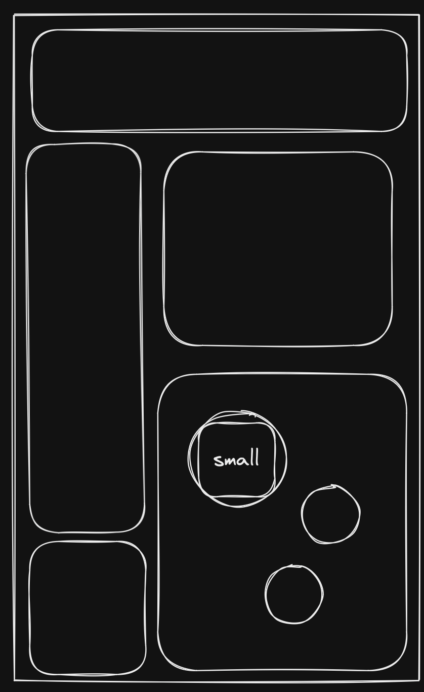
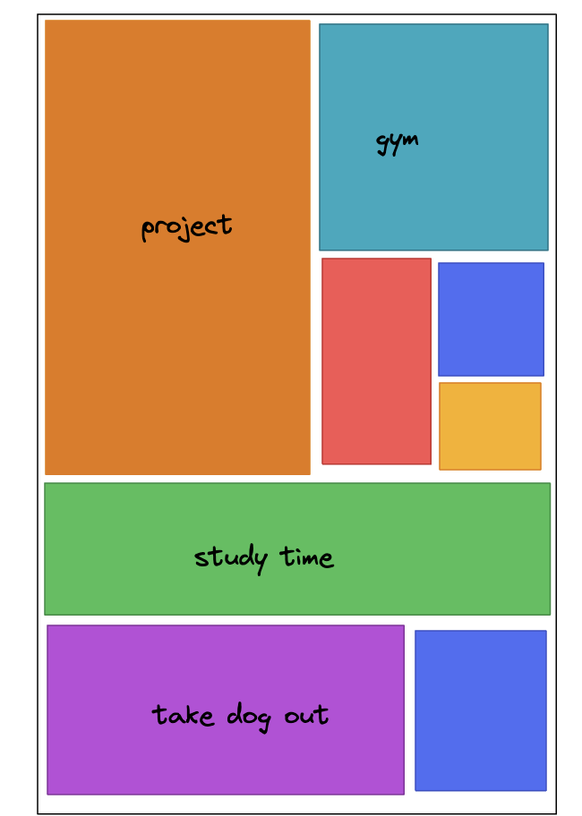

# Project ideas

## Interactive shape todo list

> TLDR: Todo list which organises tasks using shapes and animations to visualise
> tasks and their importance/priority

Main summary:

- Square dynamic mosaic layout for meta tasks:
  - take up space based on priority
- In each meta-task we have shapes to represent the subtasks
- Infinite zoom so everything is a meta-task essentially

{#fig-todo-subtasks}

{#fig-todo-mosaic}

## Word recall notification app

> TLDR: persistent notification that doesnt go away until you enter the words
> you specified that you wanted to learn

The user will set a pool of words/specific words and the app will prompt the
user to reinput them periodically as a learning mechanism.

MVP:

- Screen interrupts user and prompts them to input the words they said they
  wanted to learn
- Interruption screen shows at random points during the day
- Enter the words:
  - correct then great
  - incorrect, show word and definition

Further:

- Have pool of words which randomly get chosen from
- Archive words after the user gets them correct enough times

## Closest to finder

Find the closest location specified
